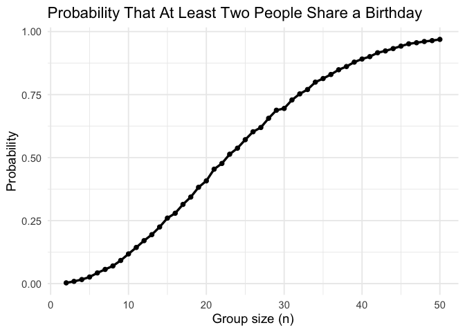
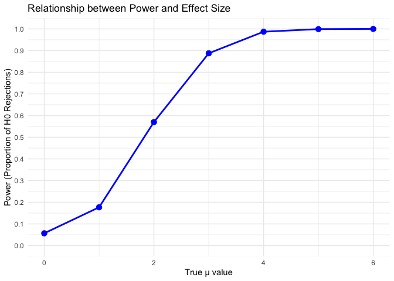
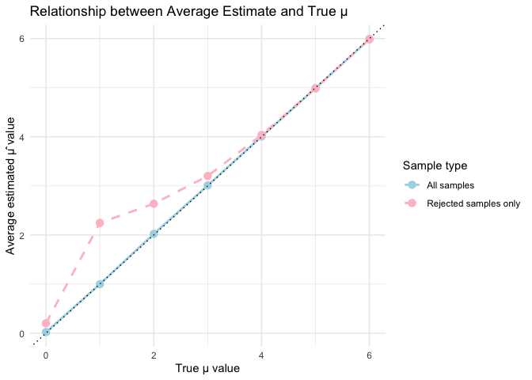
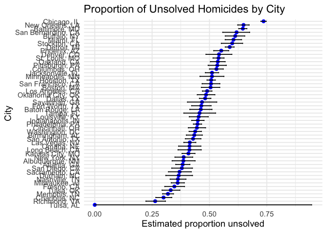

p8105_hw5_zx2528
================
Zizhi Xia_zx2528
2025-11-14

# problem 1

``` r
birthday_sim = function(n) {
  birthdays = sample(1:365, size = n, replace = TRUE)
  any(duplicated(birthdays))
}
```

``` r
library(tidyverse)
```

    ## ── Attaching core tidyverse packages ──────────────────────── tidyverse 2.0.0 ──
    ## ✔ dplyr     1.1.4     ✔ readr     2.1.5
    ## ✔ forcats   1.0.0     ✔ stringr   1.5.2
    ## ✔ ggplot2   4.0.0     ✔ tibble    3.3.0
    ## ✔ lubridate 1.9.4     ✔ tidyr     1.3.1
    ## ✔ purrr     1.1.0     
    ## ── Conflicts ────────────────────────────────────────── tidyverse_conflicts() ──
    ## ✖ dplyr::filter() masks stats::filter()
    ## ✖ dplyr::lag()    masks stats::lag()
    ## ℹ Use the conflicted package (<http://conflicted.r-lib.org/>) to force all conflicts to become errors

``` r
set.seed(1234)

results =
  tibble(
    n = 2:50,
    prob = map_dbl(n, function(x) {
      mean(replicate(10000, birthday_sim(x)))
    })
  )
```

``` r
results %>%
  ggplot(aes(x = n, y = prob)) +
  geom_line(size = 1.2) +
  geom_point(size = 1.8) +
  labs(
    title = "Probability That At Least Two People Share a Birthday",
    x = "Group size (n)",
    y = "Probability"
  ) +
  theme_minimal(base_size = 14)
```

    ## Warning: Using `size` aesthetic for lines was deprecated in ggplot2 3.4.0.
    ## ℹ Please use `linewidth` instead.
    ## This warning is displayed once every 8 hours.
    ## Call `lifecycle::last_lifecycle_warnings()` to see where this warning was
    ## generated.

<!-- --> We
observe that the probability of shared birthdays increases rapidly as
group size increases. By the time the group size reaches 50, the
probability is above 95%, showing that duplicates become almost
guaranteed in moderately large groups despite having 365 possible
birthdays.

# problem2

``` r
library(broom)
library(tidyverse)

n <- 30
sigma <- 5
n_simulations <- 5000
alpha <- 0.05

mu_values <- c(0, 1, 2, 3, 4, 5, 6)

simulate_t_test <- function(mu, n, sigma) {

  x <- rnorm(n, mean = mu, sd = sigma)
  
  test_result <- t.test(x, mu = 0, alternative = "two.sided")
  
  tidy_result <- tidy(test_result)
  
  return(data.frame(
    mu_hat = tidy_result$estimate,
    p_value = tidy_result$p.value
  ))
}
```

``` r
results <- data.frame()

for (mu in mu_values) {
  
  sim_results <- replicate(n_simulations, 
                           simulate_t_test(mu, n, sigma), 
                           simplify = FALSE)
  
  sim_df <- bind_rows(sim_results)
  sim_df$true_mu <- mu
  sim_df$rejected <- sim_df$p_value < alpha
  
  results <- bind_rows(results, sim_df)
}

power_summary <- results %>%
  group_by(true_mu) %>%
  summarise(
    power = mean(rejected),
    avg_estimate_all = mean(mu_hat),
    avg_estimate_rejected = mean(mu_hat[rejected]),
    n_rejected = sum(rejected)
  )

print(power_summary)
```

    ## # A tibble: 7 × 5
    ##   true_mu  power avg_estimate_all avg_estimate_rejected n_rejected
    ##     <dbl>  <dbl>            <dbl>                 <dbl>      <int>
    ## 1       0 0.0568           0.0217                 0.202        284
    ## 2       1 0.177            0.999                  2.25         884
    ## 3       2 0.570            2.02                   2.64        2851
    ## 4       3 0.888            3.01                   3.20        4438
    ## 5       4 0.987            4.01                   4.04        4936
    ## 6       5 0.999            4.99                   4.99        4996
    ## 7       6 1                5.99                   5.99        5000

``` r
plot1 <- ggplot(power_summary, aes(x = true_mu, y = power)) +
  geom_line(color = "blue", size = 1) +
  geom_point(color = "blue", size = 3) +
  labs(
    title = "Relationship between Power and Effect Size",
    x = "True μ value",
    y = "Power (Proportion of H0 Rejections)"
  ) +
  theme_minimal() +
  scale_y_continuous(limits = c(0, 1), breaks = seq(0, 1, 0.1))

print(plot1)
```

<!-- -->
Power increases as the true effect size μ increases.  
When μ = 0, the rejection rate is approximately 0.05, matching the Type
I error rate.  
As μ becomes larger, the sample mean is more likely to differ
substantially from 0, leading to higher power.

``` r
plot2 <- ggplot(power_summary, aes(x = true_mu)) +
  geom_line(aes(y = avg_estimate_all, color = "All samples"), size = 1) +
  geom_point(aes(y = avg_estimate_all, color = "All samples"), size = 3) +
  geom_line(aes(y = avg_estimate_rejected, color = "Rejected samples only"), 
            size = 1, linetype = "dashed") +
  geom_point(aes(y = avg_estimate_rejected, color = "Rejected samples only"), size = 3) +
  geom_abline(slope = 1, intercept = 0, linetype = "dotted", color = "black") +
  labs(
    title = "Relationship between Average Estimate and True μ",
    x = "True μ value",
    y = "Average estimated μ̂ value",
    color = "Sample type"
  ) +
  theme_minimal() +
  scale_color_manual(values = c("All samples" = "lightblue", 
                                 "Rejected samples only" = "pink"))
print(plot2)
```

<!-- -->
Across all samples, the average estimated μ̂ closely matches the true
value μ, confirming that the sample mean is an unbiased estimator.  
However, among *significant* results (p \< 0.05), μ̂ is consistently
larger than the true μ.  
This inflation is most pronounced when μ is small and power is low.

This simulation illustrates how effect size influences the performance
of a one-sample t-test.  
Power increases with μ because larger effect sizes produce sample means
further from zero, making it more likely to reject the null hypothesis.

The sample mean itself is an unbiased estimator: across all
replications, μ̂ closely matches the true μ.  
However, when conditioning on statistically significant findings, μ̂
becomes inflated—a manifestation of selection bias.

Overall, these results demonstrate why statistically significant
estimates tend to exaggerate effect sizes.

# problem3

``` r
library(tidyverse)
library(broom)

homicide_df <- read_csv("data/homicide-data.csv")
```

    ## Rows: 52179 Columns: 12
    ## ── Column specification ────────────────────────────────────────────────────────
    ## Delimiter: ","
    ## chr (9): uid, victim_last, victim_first, victim_race, victim_age, victim_sex...
    ## dbl (3): reported_date, lat, lon
    ## 
    ## ℹ Use `spec()` to retrieve the full column specification for this data.
    ## ℹ Specify the column types or set `show_col_types = FALSE` to quiet this message.

``` r
homicide_df
```

    ## # A tibble: 52,179 × 12
    ##    uid        reported_date victim_last  victim_first victim_race victim_age
    ##    <chr>              <dbl> <chr>        <chr>        <chr>       <chr>     
    ##  1 Alb-000001      20100504 GARCIA       JUAN         Hispanic    78        
    ##  2 Alb-000002      20100216 MONTOYA      CAMERON      Hispanic    17        
    ##  3 Alb-000003      20100601 SATTERFIELD  VIVIANA      White       15        
    ##  4 Alb-000004      20100101 MENDIOLA     CARLOS       Hispanic    32        
    ##  5 Alb-000005      20100102 MULA         VIVIAN       White       72        
    ##  6 Alb-000006      20100126 BOOK         GERALDINE    White       91        
    ##  7 Alb-000007      20100127 MALDONADO    DAVID        Hispanic    52        
    ##  8 Alb-000008      20100127 MALDONADO    CONNIE       Hispanic    52        
    ##  9 Alb-000009      20100130 MARTIN-LEYVA GUSTAVO      White       56        
    ## 10 Alb-000010      20100210 HERRERA      ISRAEL       Hispanic    43        
    ## # ℹ 52,169 more rows
    ## # ℹ 6 more variables: victim_sex <chr>, city <chr>, state <chr>, lat <dbl>,
    ## #   lon <dbl>, disposition <chr>

``` r
homicide_clean <- homicide_df %>%
  mutate(
    city_state = str_c(city, ", ", state),
    unsolved = disposition %in% c("Closed without arrest", "Open/No arrest")
  ) %>%
  group_by(city_state) %>%
  summarise(
    total = n(),
    unsolved = sum(unsolved)
  )

homicide_clean
```

    ## # A tibble: 51 × 3
    ##    city_state      total unsolved
    ##    <chr>           <int>    <int>
    ##  1 Albuquerque, NM   378      146
    ##  2 Atlanta, GA       973      373
    ##  3 Baltimore, MD    2827     1825
    ##  4 Baton Rouge, LA   424      196
    ##  5 Birmingham, AL    800      347
    ##  6 Boston, MA        614      310
    ##  7 Buffalo, NY       521      319
    ##  8 Charlotte, NC     687      206
    ##  9 Chicago, IL      5535     4073
    ## 10 Cincinnati, OH    694      309
    ## # ℹ 41 more rows

``` r
baltimore <- homicide_clean %>%
  filter(city_state == "Baltimore, MD")

baltimore_test <- prop.test(
  x = baltimore$unsolved,
  n = baltimore$total
)

baltimore_tidy <- broom::tidy(baltimore_test)

baltimore_tidy
```

    ## # A tibble: 1 × 8
    ##   estimate statistic  p.value parameter conf.low conf.high method    alternative
    ##      <dbl>     <dbl>    <dbl>     <int>    <dbl>     <dbl> <chr>     <chr>      
    ## 1    0.646      239. 6.46e-54         1    0.628     0.663 1-sample… two.sided

``` r
city_results <- homicide_clean %>%
  mutate(
    test = map2(unsolved, total, ~ prop.test(.x, .y)),
    tidy = map(test, broom::tidy)
  ) %>%
  unnest(tidy) %>%
  select(city_state, estimate, conf.low, conf.high)
```

    ## Warning: There was 1 warning in `mutate()`.
    ## ℹ In argument: `test = map2(unsolved, total, ~prop.test(.x, .y))`.
    ## Caused by warning in `prop.test()`:
    ## ! Chi-squared approximation may be incorrect

``` r
city_results
```

    ## # A tibble: 51 × 4
    ##    city_state      estimate conf.low conf.high
    ##    <chr>              <dbl>    <dbl>     <dbl>
    ##  1 Albuquerque, NM    0.386    0.337     0.438
    ##  2 Atlanta, GA        0.383    0.353     0.415
    ##  3 Baltimore, MD      0.646    0.628     0.663
    ##  4 Baton Rouge, LA    0.462    0.414     0.511
    ##  5 Birmingham, AL     0.434    0.399     0.469
    ##  6 Boston, MA         0.505    0.465     0.545
    ##  7 Buffalo, NY        0.612    0.569     0.654
    ##  8 Charlotte, NC      0.300    0.266     0.336
    ##  9 Chicago, IL        0.736    0.724     0.747
    ## 10 Cincinnati, OH     0.445    0.408     0.483
    ## # ℹ 41 more rows

``` r
city_results %>%
  mutate(city_state = fct_reorder(city_state, estimate)) %>%
  ggplot(aes(x = city_state, y = estimate)) +
  geom_point(size = 2, color = "blue") +
  geom_errorbar(aes(ymin = conf.low, ymax = conf.high), width = 0.3) +
  coord_flip() +
  labs(
    title = "Proportion of Unsolved Homicides by City",
    x = "City",
    y = "Estimated proportion unsolved"
  ) +
  theme_minimal(base_size = 14)
```

<!-- -->

The proportion of unsolved homicides varies widely across major U.S.
cities.  
Baltimore, MD has one of the highest rates, with an estimated unsolved
proportion of  
0.646 and a 95% confidence interval of  
(0.628, 0.663).

Other cities exhibit substantially lower proportions, while some show
even higher unsolved rates.  
These differences may reflect variations in investigative resources,
community cooperation,  
case complexity, and police department practices.

Confidence intervals are wider in cities with fewer total homicides,
reflecting greater uncertainty,  
while larger cities provide more precise estimates.
